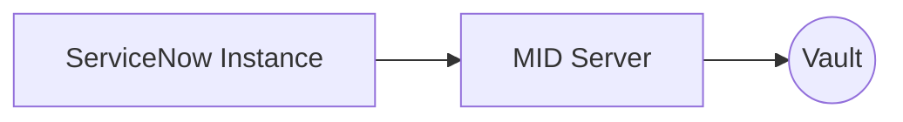
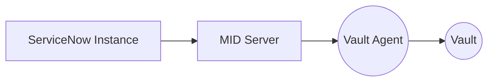
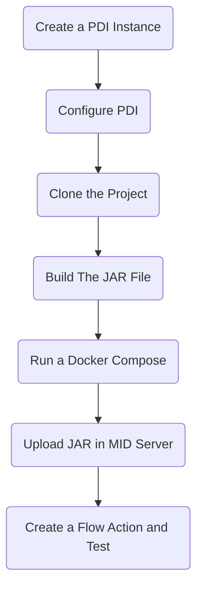

# sn-vault-credential-resolver-python
This project was a study of the integration between a [ServiceNow instance](https://www.servicenow.com/) and the [HashiCorp Vault](https://www.hashicorp.com/products/vault). The aim was for a ServiceNow instance to be able to retrieve a secret stored in the HashiCorp Vault and use this credential to carry out an action. 

For this study, several attempts were made using the documentation available from both [ServiceNow](https://docs.servicenow.com/pt-BR/bundle/vancouver-platform-security/page/product/credentials/concept/external_cred_storage_configuration.html) and [HashiCorp](https://developer.hashicorp.com/vault/docs/platform/servicenow). The solutions contained in these documentations have different solutions, which when applied by me did not prove to be effective, and I believe that this is possibly due to the lack of detail in these documentations.

My initial scenario was similar to this diagram:


In this scenario I had some complications, mainly because the Vault Server was configured to authenticate with AWS credentials (aws_auth). It seems that the existing documentation on this type of authentication is a little vague and does not, in my opinion, allow a correct interpretation of what is really going on behind the scenes.

# My Journey

## 1. Using the ServiceNow documentation
In this solution, the MID Server must talk directly to the Vault Server, so it is responsible for authenticating to the Vault, retrieving the secret and parsing it depending on the type of credential specified in the instance:

There are some complications to be considered in this regard:
1. MID Server is a Java application developed by ServiceNow so that the instance can perform tasks or obtain information from within a "closed" infrastructure. This application allows new classes to be instantiated so that new functionalities (plugins) can be added.
2. HashiCorp's example documentation does not contain examples of how to perform this authentication in Java. The examples I found make use of the [Spring driver](https://spring.io/projects/spring-vault), which I particularly couldn't get to work, since MID Server is not a Spring application.
3. In the ServiceNow documentation, the example class available on [GitHub](https://github.com/ServiceNow/mid-hashicorp-external-credential-resolver) uses the [bettercloud driver](https://github.com/BetterCloud/vault-java-driver), where there is practically no documentation for this type of authentication and it seems to me that this project has been stalled for a long time (if it hasn't been abandoned).
4. ServiceNow's documentation on the subject of Credential Resolver is very poor, with very little detail on how the solution actually works. This is very bad, since part of the documentation asks you to develop a Java class to recover the credential (secret) in the Vault. This makes implementation very difficult, because we don't know the limits of what can be done, which dependencies can be used and which methods we already have available and can reuse
5. I'm not very proficient in Java and I'm just starting to get to grips with the AWS environment (I think that's the main difficulty factor here).

## 2. Using the HashiCorp documentation
The solution proposed by HashiCorp is similar to ServiceNow, but one more piece is added to this architecture: The Vault Agent. The Vault Agent is an existing part of HashiCorp's architecture with the aim of allowing applications that do not have the ability to use the APIs available by the Vault Server to be able to obtain the secrets stored in it.

In order for the MID Server to be able to make use of the Vault Agent, a Java class is made available which, from what I think, makes use of the same solution proposed by Service Now.

The problem here is that the documentation does not explicitly specify which types of authentication are accepted and looking at the [source code of this class](https://github.com/hashicorp/vault-servicenow-credential-resolver) it seemed to me that it only accepts a single type of authentication through a certificate.

Although I can configure authentication between the Vault Agent and the Vault Server in several ways, it seems that this class uses the Vault Agent as if it were a proxy, that is, it just forwards the call and I believe that due to this, the existing authentication between the Vault Agent and the Vault Server seems to be ignored and ends up requiring a new authentication.

## 3. How I tried to solve my problem
To solve my problem I did a mix of both solutions: I used the Java class proposed by ServiceNow and created a part in the middle as if it were a Vault Agent.

This piece in the middle is a Rest API made in Python (just because I'm a little more familiar with this language and I was a little angry about trying and erroring the java class :clown_face:) using [FastAPI](https://fastapi.tiangolo.com).

To simulate an AWS environment locally I chose to use [LocalStack](https://github.com/localstack/localstack). This simulation did not allow using Vault Server authentication via aws_auth, since LocalStack has not yet implemented the decode_authorization_message STS method.

Well, in the end, I wasn't able to reach my initial scenario, but I decided to continue to see if there was a solution for my journey.

### 3.1. The solution
I found a solution that I think is very interesting and that I believe can be used in several other scenarios.

#### How does it work
When the ServiceNow instance needs something that makes use of a secretly stored credential in the Vault, it creates a task for the MID Server in the ECC queue. As soon as the MID Server is available, it takes this task from the queue, realizing that it involves a credential stored in the Vault. To retrieve this credential, it instantiates the Java CredentialResolver Class. This class makes a call to the Python API, which in turn authenticates to the Vault Server, retrieves the credential and returns it to the Java CredentialResolver Class. The credential possession class performs the parsing according to the type of credential and from then on the task execution flow returns to normal.

#### How to use
Macro Steps:


1. Log in to https://developer.servicenow.com/ and request a developer instance (PDI)

2. Install the necessary plugins:
    - Access the website [developer.servicenow.com](https://developer.servicenow.com/dev.do)
    - In the top bar, click on your user's avatar, in the instance actions column click on `Activate Plugin`
    - In the search box, type `External Credential Storage` and click `Activate`
    - In the search box, type `ServiceNow IntegrationHub Installer` and click `Activate`
    - Wait for the plugins to be installed. You will receive emails when the installations are complete.

3. Create the **required users**:
    - Access your ***PDI*** and log in with the user `admin` and create the following users:
        - User that will be used by **MID Server** to access ServiceNow:
            * Access the `System Security > Users` menu
            * Click on `New`
            * Fill in the fields:
                - `First name`: `MID`
                - `Last name`: `Server`
                - `User name`: `mid_server`
                - `Email`: `mid_server@mid_server.com`
                - `Active`: `true`
            * Click `Submit`
            * Click on `Set Password`
                - Click on `Generate`
                - Copy the generated password
                - Click on `Save Password` and then `OK`
            * When returning to the user registration, uncheck the `Password needs reset` option and save the registration
            * In the `Roles` releated list, click `New` and select the `mid_server` role
        - User that will be used as an **example credential to be retrieved from the Vault**:
            * Access the `System Security > Users` menu
            * Click on `New`
            * Fill in the fields:
                - `First name`: `Test`
                - `Last name`: `User`
                - `User name`: `test_user`
                - `Email`: `test_user@test_user.com`
                - `Active`: `true`
            * Click `Submit`
            * Click on `Set Password`
                - Click on `Generate`
                - Copy the generated password
                - Click on `Save Password` and then `OK`
            * When returning to the user registration, uncheck the `Password needs reset` option and save the registration
    
4. Create the **credential**:
     - Access your ***PDI*** and log in with the user `admin`
     - Access the menu `Connections & Credentials > Credentials`
         - Click on `New`
         - In the interseptor select `Basic Auth Credentials`
         - Fill in the fields:
             - `Name`: `test_user`
         - Click `Submit`
         - Access the connection menu and change the view to `External Credential Store`
         - Clear the `Password` field
         - Check the option `External Credential Store`
         - In the `Credential storage` field select `None`
         - In the `Credential ID` field, type the following path:
         ```
             kv-midserver/test_user
         ```
         - Click `Submit`

5. Create a **connection**:
     - Access the Menu `Connections & Credentials > Connections`:
         - Click on `New`
         - In the interseptor select `HTTP(s) Connection`
         - Fill in the fields:
             - `Name`: `Get User List`
             - `Credential`: `test_user`
         - Click `Submit`

6. Install [Docker](https://docs.docker.com/get-docker/) and [Docker Compose](https://docs.docker.com/compose/install/)

7. Clone this repository
8. Create a `.env` file:
```env
VAULT_TOKEN="root"
VAULT_ADDR="http://vault_server:8200"

AWS_STS_ENDPOINT="http://localstack:4566"
AWS_SECRET_ENDPOINT="http://localstack:4566"
AWS_REGION="us-east-1"
AWS_ACCESS_KEY="test"
AWS_SECRET_KEY="test"
AWS_ACCOUNT_ID="000000000000"

AWS_ROLE_ARN="arn:aws:iam::000000000000:role/role"
AWS_ROLE="role"
AWS_SECRET_NAME="test"

SECRET_USER_NAME="test_user"
SECRET_USER_PWD="<password created in step 3 in Service Now Instance>"
SECRET_PATH="kv-midserver"
LOG_LEVEL="DEBUG"
CHECK_MODE="FALSE"

LOCALSTACK_SERVICES="sts,secretsmanager,iam"

MID_INSTANCE_URL="https://<your instance>.service-now.com/"
MID_INSTANCE_USERNAME="mid_server"
MID_INSTANCE_PASSWORD="<password created in step 3 in Service Now Instance>"
MID_SERVER_NAME="mid-vault"    
```

9. Now you need to build the java class jar that needs to be loaded on the mid server. This project is in the `mid-server/mid-hashicorp-external-credential-resolver` folder. It's a maven java project and you can use the IDE you prefer (Eclipse, Intellij, VS Code, etc).

10. Start the docker compose:
```bash
```bash
docker-compose up --build
```

11. Validating the **MID Server**:
    - Access your ***PDI*** and log in with the user `admin`
    - Access the `MID Server > Servers` menu
    - Select the `mid-vault` server
    - Click on `Validate`
    - Wait for the validation to finish and check the result :tada:

12. Uploadin the `CredentialResolver` **JAR file** to the MID Server:
    - Access your ***PDI*** and log in with the user `admin`
    - Access the `MID Server > JAR Files` menu
    - Click on `New`
    - Fill in the fields:
        - `Name`: `CredentialResolver`
        - `Version`: `0.0.1`
        - Click on the `Paperclip` in the upper right corner of the screen and select the `mid-server/mid-hashicorp-external-credential-resolver/target/hashicorp-credential-resolver-0.0.1-SNAPSHOT.jar` file.

13. Restarting ***MID Server***:
    - Access your ***PDI*** and log in with the user `admin`
    - Access the `MID Server > Servers` menu
    - Select the `mid-vault` server
    - Click on `Restart`
    - Wait for the restart to finish and check the result :tada:

14. Validating the `Credential Resolver`:
    - Access your ***PDI*** and log in with the user `admin`
    - Access the `Flow Designer` menu
    - In the new open screen, create a new `Action`:
        - On the `Action Properties` Screen:
            - Fill in the fields:
                - `Name`: `Test Credential Resolver`
                - `Description`: `Test Credential Resolver`
                - Leave the other fields at their default values
            - Click `Submit`
        - On the `Action Designer` Screen:
            - Add a step of type `REST`:
                - On the `Step Properties` screen:
                    - `Connection`: `Use Connection Alias`
                    - `Connection Alias`:
                    - Click on the `+` button. You will be directed to the screen for creating an `HTTP(s) Connection`:
                        - Fill in the fields:
                            - `Name`: `Get User List`
                            - `Credential`: `test_user`
                            - `Connection Aias`: Click in `magnifier glass` and New Button
                            - `Name`: Service Now Intance
                            - Click `Submit`
                            - `Connection URL`: `https://<your instance>.service-now.com/`
                            - `Use MID Server`: `true`
                            - `MID Selection` : `Specific MID Server`
                            - `MID Server`: `mid-vault`
                            - Click `Submit`
                    - In Request Details:
                        - Build Request: `Manually`
                        - Resource Path: `aapi/now/table/sys_user?sysparm_query=user_name%3Dtest_user`
                        - HTTP method: `GET`
                    - Click `Save`
                    - Click `Test`
                    - In the Test Action screen, click `Run Test`
                    - Wait for the test to finish and check the result :tada:
